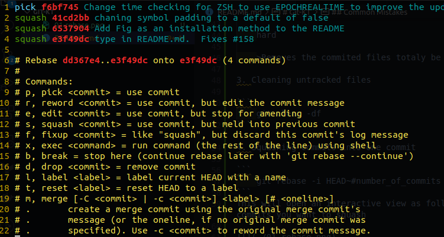
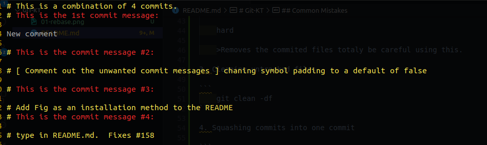

# Git-KT

## Git Cherry Pick

This is used to move specific commits between branchs. You need to aquire the commits hash ID from the first_branch:

```
    git checkout first_branch

    git log

    # Take the commit hash id.
```
Then checkout to the second_branch and run the following command

```
    git cherry-pick (commit_hash_id)'s
```

You can also bring the commits over to the second_branch without commiting them using ``` -n ``` option.

## Common Mistakes

1. Wrong commit message

```
    git commit --amend -m "Correct message"
```

2. Commits on the wrong branch

    - Move commit to the correct branch

    ```
        git checkout wrong_branch

        git log

        # Take the commit hash id.

        git checkout correct_branch

        git cherry-pick wrong_brach_commit_hash
    ```

    - Remove commit from the wrong branch

    ```
        git checkout wrong_branch

        git reset --hard commit_hash_to_reset_to
    ```
    There are 3 types of ```git reset``` we have

    soft

    >Returns files to stage state.

    normal

    >Returns files to the working space.

    hard

    >Removes the commited files totaly be careful using this.

3. Cleaning untracked files

```
    git clean -df
```

4. Squashing commits into one commit

```
    git rebase -i HEAD~#number_of_commits
```
This will open an interactive view as follows, where you can chose which commits you want to squash



After saving this file you'll be able to edit the commit messeage that you want, from the following file



The last step is to force push the new commit

```
    git push --force
```